

# poe-seller

**Your Path of Exile stash, priced by poe.ninja — and a straight answer to “what do I sell?”**

    

### 

**English** · [Français](#francais)

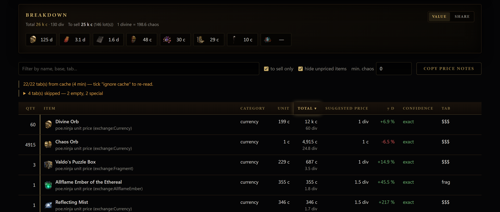

---

## Download

### [→ Get the latest version](../../releases/latest)

On the page that opens, under **Assets**, click `poe-seller-<version>-setup.exe`.

Windows only for now. This repository holds **no code**: it only hosts the installers and the
update manifest the app reads.

---

## What it does

You paste your session cookie once, tick the stash tabs you care about, and hit **Scan**.
Ten seconds later you know what your stash is worth, what deserves a price note, and at what
price.

### Where the value actually is

One chip per category — currency, uniques, cards, gems, maps… — with the icon of its most
expensive lot. Hover for the details; **click a chip to switch the category off** and see what
the rest is worth, without rescanning.

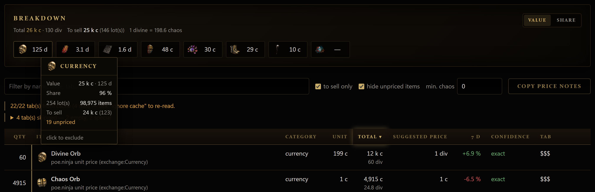

### Every lot, priced

Sortable, filterable, with the poe.ninja unit price, the total, the suggested price, the 7-day
trend and how much to trust it. Hover an item for its real in-game tooltip.

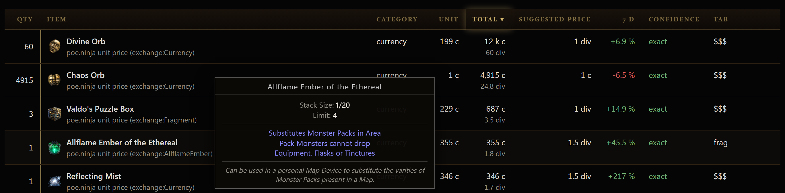

**Copy price notes** puts `~price 12 chaos` lines in your clipboard, ready to paste in game.

### Two dates, one answer

Archive a scan with **⧉ Snapshot**, then compare two of them. The difference is split between
what came from **items** you gained or lost and what came from **prices** — the market's doing.
The two always add up exactly to the total change.

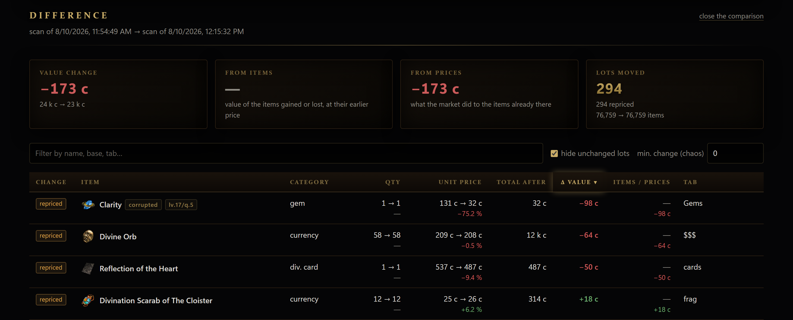

<b>More screenshots</b>

**Your stash tabs, with their in-game colours and affinity icons**

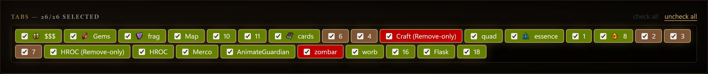

**The snapshot panel — tick two, compare**

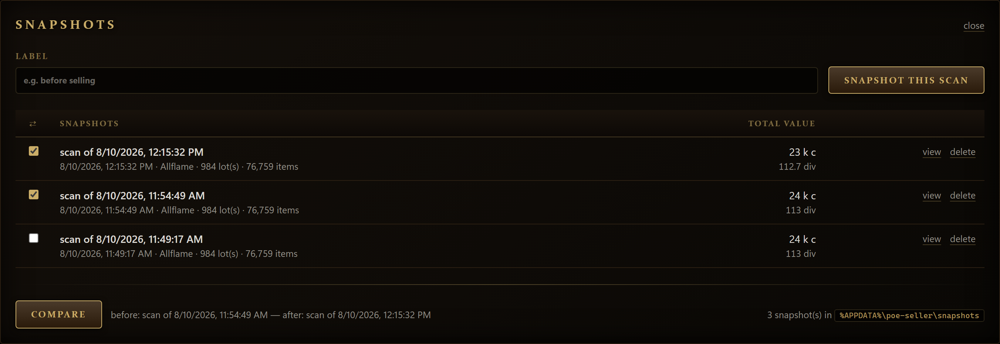

**Settings — everything from one screen, cookie included**

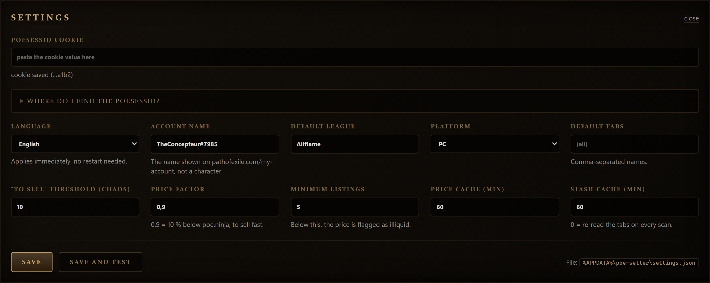

---

## Installing

**“Windows protected your PC”** — expected, and you should go ahead anyway:
click **More info**, then **Run anyway**.

That message accuses the app of nothing: Windows shows it for any program whose publisher
hasn't bought a code-signing certificate (several hundred euros a year). The warning fades on
its own as more people install the app.

**Antivirus complaining?** Same story: unsigned installers sometimes trigger a false positive.
Allow the file.

## First run

1. Open **⚙ Settings**, paste your `POESESSID` cookie, then **Save and test**.
   The panel tells you where to find the cookie, step by step.
2. Tick the tabs you want, pick your league.
3. **Scan**.

Your cookie stays on your machine, in the settings file of your user folder, and is only ever
sent to pathofexile.com. Never share it. It expires after a few months, or when you log out —
paste it again and you're back.

## Updates

Nothing to do. The app checks for a newer version on its own, downloads it in the background,
and offers to restart. Decline, and it installs the next time you close the app.

So you only need this page once, for the first install.

## Something wrong?

Just message me.

 

---

# poe-seller

**Tes stash Path of Exile, croisés avec les prix poe.ninja — et une réponse claire à « je vends quoi ? »**

    

### 

[English](#english) · **Français**

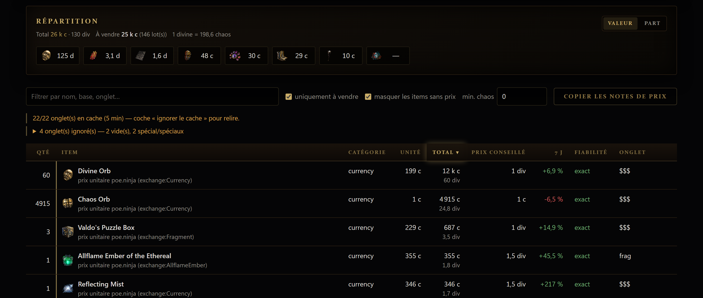

---

## Téléchargement

### [→ Récupérer la dernière version](../../releases/latest)

Sur la page qui s'ouvre, sous **Assets**, clique sur `poe-seller-<version>-setup.exe`.

Windows uniquement pour l'instant. Ce dépôt ne contient **pas de code** : il ne sert qu'à
héberger les installeurs et le fichier de mise à jour lu par l'application.

---

## Ce que ça fait

Tu colles ton cookie de session une fois, tu coches les onglets qui t'intéressent, tu cliques
**Scanner**. Dix secondes plus tard tu sais ce que vaut ton stash, ce qui mérite une note de
prix, et à combien.

### Où est vraiment la valeur

Une puce par catégorie — currency, uniques, cartes, gemmes, maps… — avec l'icône de son lot le
plus cher. Le survol donne le détail ; **un clic éteint la catégorie** et te dit ce que vaut le
reste, sans relancer de scan.

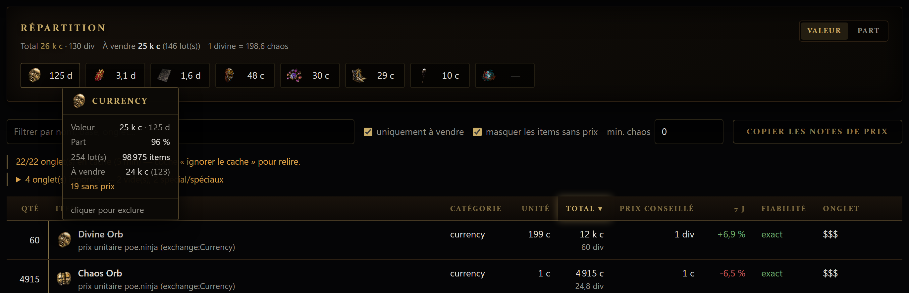

### Chaque lot, avec son prix

Triable, filtrable, avec le prix unitaire poe.ninja, le total, le prix conseillé, la tendance
sur 7 jours et la fiabilité du prix. Le survol d'un item affiche sa vraie infobulle du jeu.

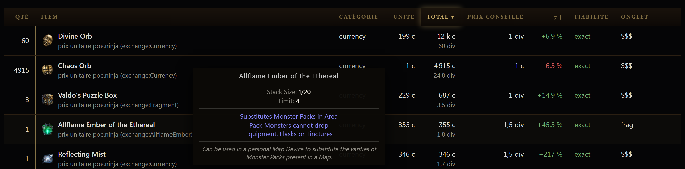

**Copier les notes de prix** met dans le presse-papier des lignes `~price 12 chaos`, prêtes à
coller en jeu.

### Deux dates, une réponse

**⧉ Snapshot** archive un scan ; il suffit ensuite d'en comparer deux. L'écart est partagé
entre ce qui vient des **items** gagnés ou perdus et ce qui vient des **prix** — le marché. Les
deux parts se somment toujours exactement à l'écart total.

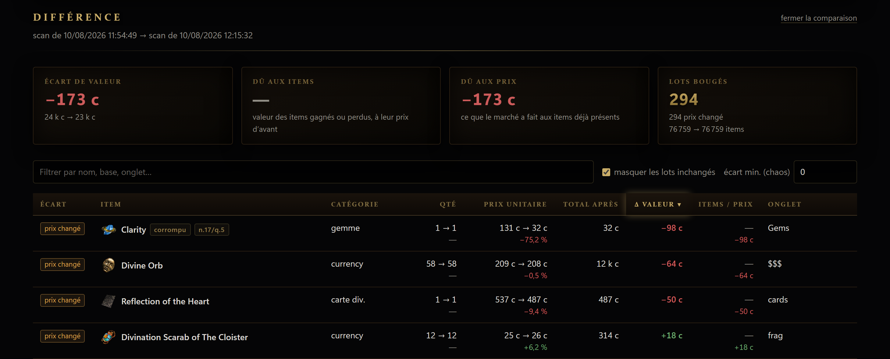

<b>Plus de captures</b>

**Tes onglets de stash, avec leurs couleurs du jeu et leurs icônes d'affinité**

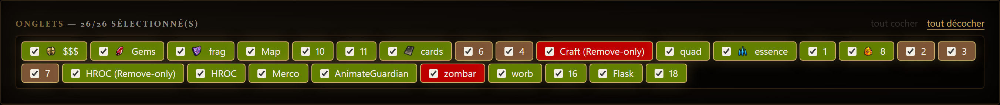

**Le panneau des snapshots — on en coche deux, on compare**

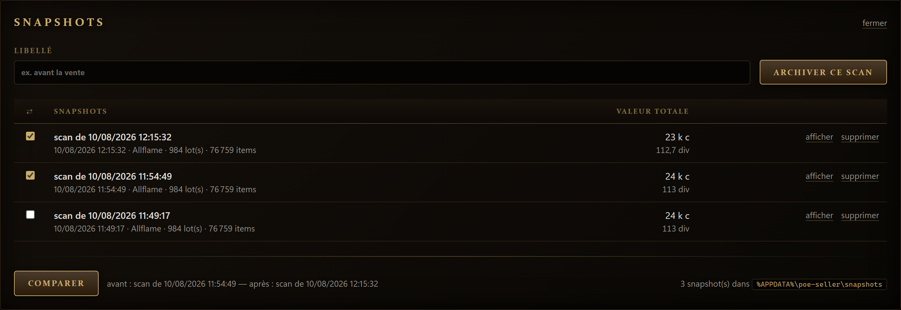

**Les réglages — tout depuis un seul écran, cookie compris**

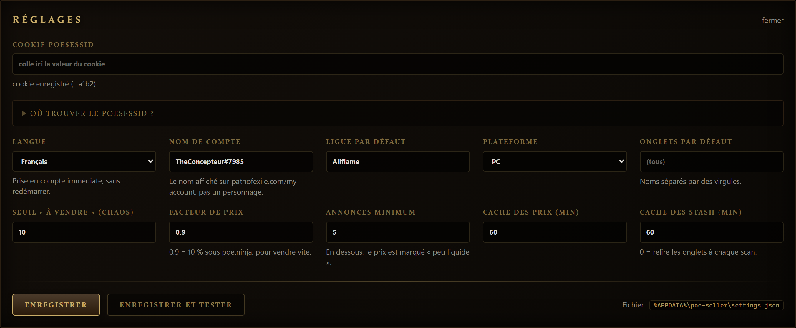

---

## À l'installation

**« Windows a protégé votre ordinateur »** — c'est normal, et il faut passer outre :
clique sur **Informations complémentaires**, puis sur **Exécuter quand même**.

Ce message n'accuse l'application de rien : Windows l'affiche pour tout programme dont
l'éditeur n'a pas acheté un certificat de signature de code (plusieurs centaines d'euros par
an). L'avertissement disparaîtra de lui-même à mesure que l'application sera installée.

**Ton antivirus râle ?** Même histoire : les installeurs non signés déclenchent parfois un faux
positif. Si ça arrive, autorise le fichier.

## Au premier lancement

1. Ouvre **⚙ Réglages**, colle ton cookie `POESESSID`, puis **Enregistrer et tester**.
   Le panneau explique où le trouver, étape par étape.
2. Coche les onglets voulus, choisis ta ligue.
3. **Scanner**.

Ton cookie reste sur ta machine, dans le fichier de réglages de ton dossier utilisateur, et
n'est envoyé qu'à pathofexile.com. Ne le partage jamais. Il expire au bout de quelques mois ou
si tu te déconnectes — il suffit alors de le recoller.

## Les mises à jour

Rien à faire. L'application vérifie toute seule s'il existe une version plus récente, la
télécharge en arrière-plan, et te propose de redémarrer. Si tu refuses, elle s'installe à la
prochaine fermeture.

Tu n'as donc besoin de cette page qu'une seule fois, pour la première installation.

## Un souci ?

Écris-moi directement.
